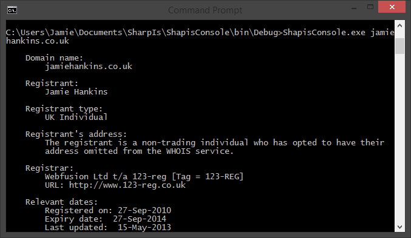

SharpIs 
=======

WHOIS lookups for C#

How do I use it
===============
Just reference the Shapis.dll and add something like the following:

`WhoisRecord rec = WhoisLookup.Lookup("jamiehankins.co.uk");`

You can then access the returned information as an `ArrayList` which can be looped through like the following

`foreach (var v in rec.Text)
{
  Console.WriteLine(v);
}`

You can see which WHOIS server was queried by looking at the Server string of the record

`Console.WriteLine(rec.Server);`

How does this work?
===================
This does a DNS query to a subdomain of whois-servers.net. The subdomain is based off the TLD of the domain being queried. Say I wanted to query google.com, The library gets the TLD and does a DNS lookup of com.whois-servers.net which returns 

`Name:    whois.verisign-grs.com`

We can then connect to this using a TCP Client and lookup the domains information which is returned as a WhoisRecord
